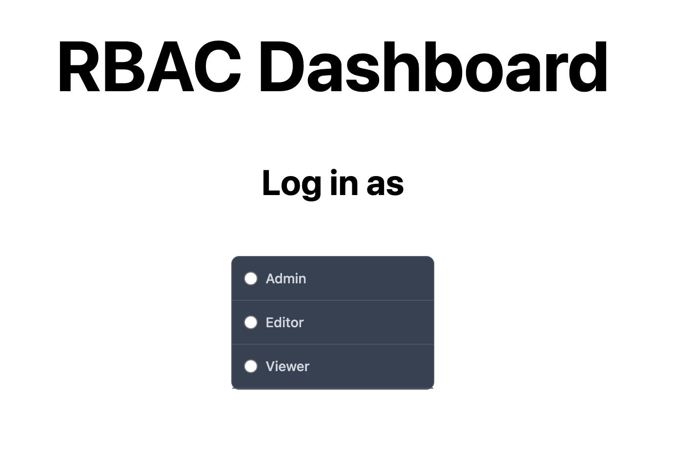
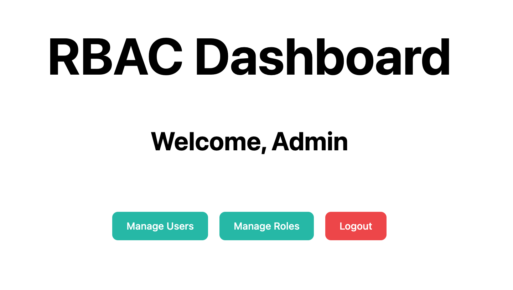
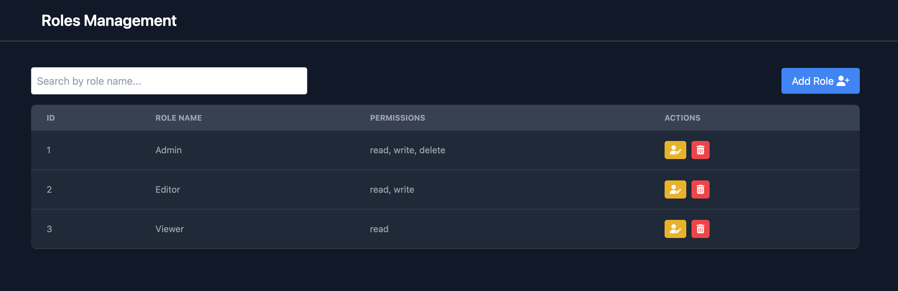
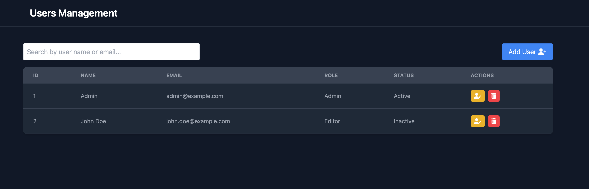

# Role-Based Access Control (RBAC) Dashboard

This project is a simple Role-Based Access Control (RBAC) dashboard built using React. It allows users to log in as different roles and access specific permissions based on their selected role. The application manages user sessions using the js-cookie library.

Features
User login as different roles (e.g., Admin, Editor, Viewer).
Role-based access control to manage:

 Users

 Roles

Session persistence using browser cookies (via js-cookie).
Logout functionality to clear session data.
Responsive UI built with Tailwind CSS.

Technologies Used
React: For building the user interface.
Redux: To manage roles and permissions data.
Tailwind CSS: For styling.
js-cookie: For handling cookies with ease.

## Setup Instructions

1. Prerequisites
   Ensure you have the following installed:

Node.js: Version 16 or higher

npm: Version 8 or higher 

2. Clone the Repository

git clone https://github.com/neha199704/RBAC-project.git

3. Install Dependencies

npm install

4. Install js-cookie
Add the js-cookie library:

npm install js-cookie

## How It Works
Login: Users select a role (e.g., Admin). The selected role is stored as a cookie using js-cookie.
Permissions: The app checks the selected role's permissions by reading the cookie and grants access accordingly.
Logout: The session cookie is cleared using js-cookie, and the user is redirected to the login screen.

### **Dashboard**

---

### **Login Dashboard**

---

### **Roles Management**

---

### **Users Management**

